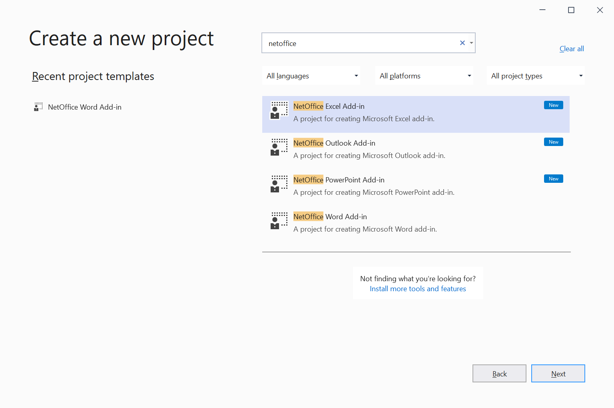

# Microsoft Office Add-ins using NetOffice

You can use the NetOffice library to create .NET Framework applications that extend Office.
These applications are also named in old MSDN documentation as __Office solutions__ or __COM Add-ins for Microsoft Office__.


## Getting Started

Download our [NetOffice extension](https://marketplace.visualstudio.com/items?itemName=NetOffice.tools) from the [Visual Studio Marketplace](https://marketplace.visualstudio.com/items?itemName=NetOffice.tools).

In the **Create new project** dialog search for NetOffice and select a template based
on the Microsoft Office application you want to extend.




Look for the `MyAddin` class in the project. Use the `MyAddin_OnConnection` method
to add handlers for the events provided by Office application.

```csharp
using NetOffice.ExcelApi.Tools;

[ComVisible(true)]
[ProgId("ExcelAddinSample.MyAddin")]
[Guid("CC85F97A-F409-4497-B2F2-A9581D4A2ED2")]
[COMAddin("MyAddin", "Addin description.", LoadBehavior.LoadAtStartup)]
public class MyAddin : COMAddin
{
    private void MyAddin_OnConnection(object application, ext_ConnectMode connectMode, object addInInst, ref Array custom)
    {
        this.Application.WorkbookOpenEvent += Application_WorkbookOpenEvent;
    }
}
```


## Advanced Add-ins

You project can have multiple add-ins targeting different Microsoft Office applications.

Each add-in class which extends `COMAddin` must have its unique **[ProgId]** and **[Guid]** values so it can be
properly identified in COM infrastructure. Each add-in class must have the **[ComVisible(true)]** attribute.

Add-in classes must extends from the `COMAddin` class provided by the NetOffice library.

### COMAddin Classes

NetOffice provides `COMAddin` classes for each Microsoft Office application.
You will find the `COMAddin` class in the `Tools` namespace in each NetOffice
library for an Office application.

|  Office Application  | NetOffice package  | Link | COMAddin Class  |
|----------------------|--------------------|------|-----------------|
|  MS Word             | `NetOfficeFw.Word` | [](https://www.nuget.org/packages/NetOfficeFw.Word/) | `NetOffice.WordApi.Tools.COMAddin` |
|  MS Excel            | `NetOfficeFw.Excel` | [](https://www.nuget.org/packages/NetOfficeFw.Excel/) | `NetOffice.ExcelApi.Tools.COMAddin` |
|  MS PowerPoint       | `NetOfficeFw.PowerPoint` | [](https://www.nuget.org/packages/NetOfficeFw.Powerpoint/) | `NetOffice.PowerPointApi.Tools.COMAddin` |
|  MS Outlook          | `NetOfficeFw.Outlook` | [](https://www.nuget.org/packages/NetOfficeFw.Outlook/) | `NetOffice.OutlookApi.Tools.COMAddin` |

