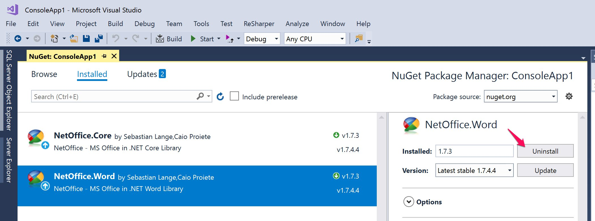
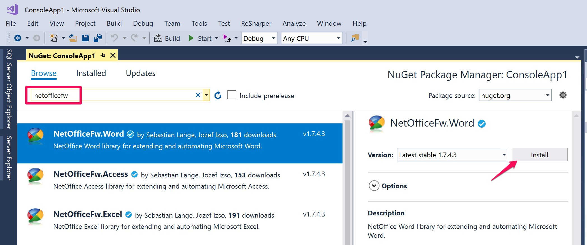

## Move Away From Old Packages

We noticed that old NetOffice packages on NuGet server are no longer available
(NetOffice releases 1.7.3 and older) and a rogue account named *netofficedotnet*
published NetOffice libraries under a release 1.7.4.4 and 1.7.4.11.
These packages contain the old NetOffice 1.7.3.0 libraries and in case of the latest releases,
packages are unusable.

Our [official NetOffice release](https://www.nuget.org/profiles/netoffice) is **1.8.1** (as of February 2021).

By using **NetOfficeFw** packages you will get the latest NetOffice libraries
and also improved debugging experience as we publish symbol packages with
the source code for the **1.7.4.x** and **1.7.5** releases.


## Upgrade Existing Projects

To upgrade existing projects which use the old **NetOffice.*** (eg. **NetOffice.Word**, **NetOffice.Excel**, **NetOffice.Outlook** and others) packages from NuGet,
you must manually uninstall these packages and get the new equivalent versions named **NetOfficeFw.***.

## Use Package Manager Console to Migrate Packages

You can use **Package Manager** in **Visual Studio** to migrate to new packages
by using these commands:

```
PM> Uninstall-Package NetOffice.Word
PM> Uninstall-Package NetOffice.Core
PM> Install-Package NetOfficeFw.Word
```


## Use NuGet Package Manager to Migrate Packages

To migrate to **NetOfficeFw** packages from Visual Studio user interface,
use NuGet Package Manager.

1. Right click on you project and choose **Manage NuGet Packages...**
0. Open **Installed** tab
0. Select your installed **NetOffice** packages
0. Click **Uninstall** button
0. Open **Browse** tab
0. Enter **netofficefw** into search box
0. Select the packages based on the MS Office application you develop for
0. Click **Install** button

> *Note:* Please, make sure you uninstall all existing NetOffice.* packages, including **NetOffice.Core**
to prevent issues in the application caused by referencing NetOffice libraries twice and
with different versions.




