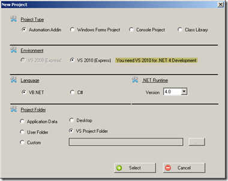

# Project Wizard

## What does the Project Wizard for you?

NetOffice offers a project wizard as extension in Visual Studio. The extension
is not supported from Visual Studio Express because this version of Visual
Studio doesnt load any extensions. As substitute for VS Express users, the
Developer Toolbox include the Project Wizard as independent application. The
generated solution are stored in VS Express Format.

## What you have to do

Click on the button "New Project" and choose your programming language and
Visual Studio Expess version.

Follow now the assistant. The Project Wizard open the new solution folder for
you in the Explorer. Click on the generated solution to open with your VS
Express Installation.
