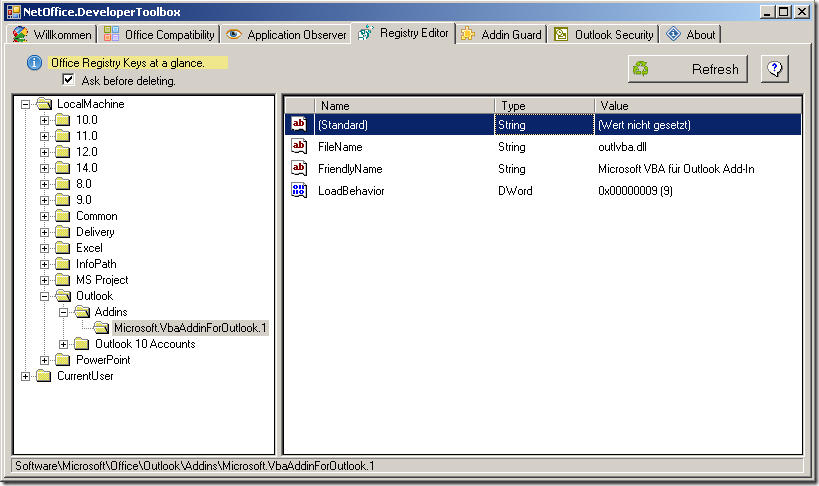

# Registry Editor

## What can the Registry Editor do for you?

The Registry-editor is technical and optical 1:1 clone of the Windows
Registry-editor, but it is limited to the registry keys of Office applications.
If you want to check or change an Office-specific key, you can do this faster
and easier with the NetOffice Registry Editor.

## Functionality and Settings

All dialogs and functions are based exactly on those of the Windows
Registry-editor. The only exception is: If you do not have adminitrator rights,
the NetOffice Registry-editor does not offer you the possibility to change keys
or values under the RootKey `HKEY_LOCAL_MACHINE`.
